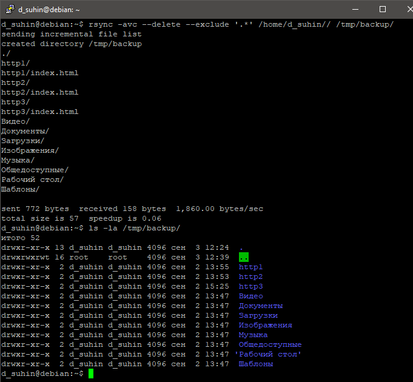
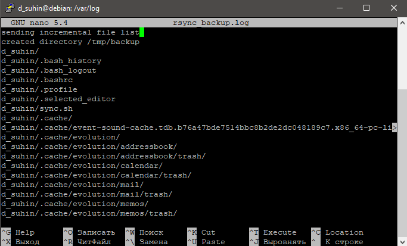
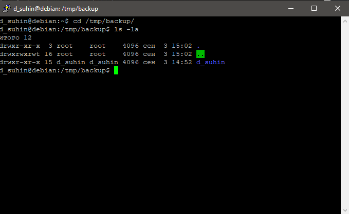

# Домашнее задание к занятию 3 «Резервное копирование»

### Задание 1.
- Составьте команду rsync, которая позволяет создавать зеркальную копию домашней директории пользователя в директорию `/tmp/backup`
- Необходимо исключить из синхронизации все директории, начинающиеся с точки (скрытые)
- Необходимо сделать так, чтобы rsync подсчитывал хэш-суммы для всех файлов, даже если их время модификации и размер идентичны в источнике и приемнике.
- На проверку направить скриншот с командой и результатом ее выполнения
------
### Ответ:
```
 rsync -avc --delete --exclude '.*' /home/d_suhin/ /tmp/backup/
```

------
### Задание 2
- Написать скрипт и настроить задачу на регулярное резервное копирование домашней директории пользователя с помощью rsync и cron.
- Резервная копия должна быть полностью зеркальной
- Резервная копия должна создаваться раз в день, в системном логе должна появляться запись об успешном или неуспешном выполнении операции
- Резервная копия размещается локально, в директории `/tmp/backup`
- На проверку направить файл crontab и скриншот с результатом работы утилиты.
------
### Ответ:
```
crontab -e
```
Запись в crontab
```
0 3 * * * /home/d_suhin/sync.sh
```
Скрипт резервного копирования и записи в лог
```
#!/bin/bash

# Указываем путь к директории, которую нужно скопировать.
source_dir="/home/d_suhin/"

# Указываем путь к месту, где будет храниться резервная копия.
backup_dir="/tmp/backup"

# Имя лог-файла и его расположение.
log_file="/var/log/rsync_backup.log"

# Выполняем резервное копирование с помощью rsync.
rsync -tacv "$source_dir" "$backup_dir" &>> "$log_file"

# Проверяем код возврата rsync и записываем результат в лог-файл.
if [ $? -eq 0 ]; then
    echo "Успешное резервное копирование: $(date)" >> "$log_file"
else
    echo "Ошибка при резервном копировании: $(date)" >> "$log_file"
fi
```
Запись в логе



Результат копирования


